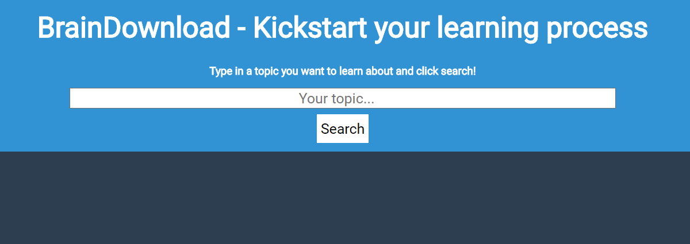
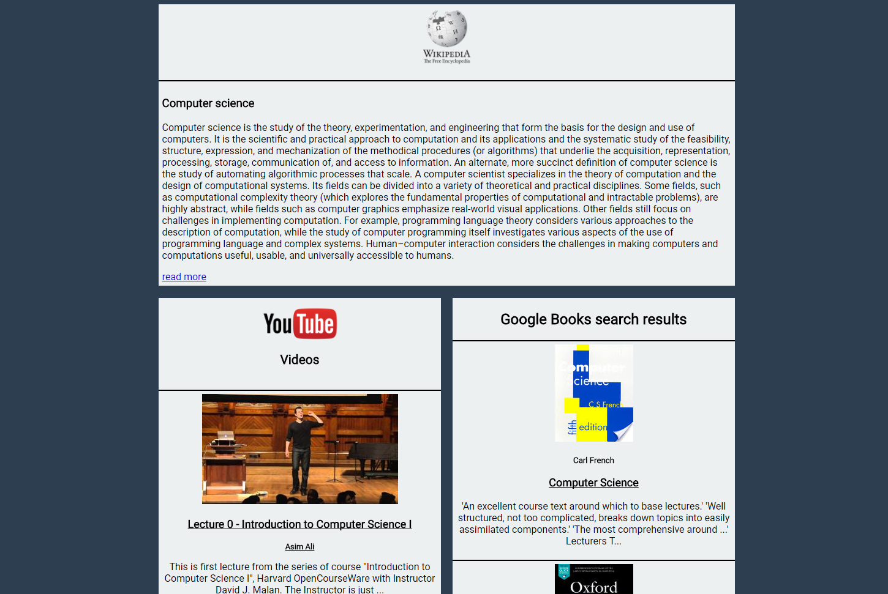

# BrainDownload

You can find a live version of the site [here](https://meamz.github.io/braindownload/)

## Table of Contents
  - [Screenshots](#screenshots)
  - [Summary](#summary)
  - [Technology used](#technology-used)
  
## Screenshots

When you go to the site you will find this header with the searchbar

Once you typed something in and clicked search the site scrolls down to the results.

## Summary

The app helps you when you want to start learning something about a new topic. 
You get all the informations which are important to start learning with one search!
You get a short Wikipedia article, YouTube videos to watch and books (from Google Books) which you could read to **'download the information into your brain'**.

## Technology used

### APIs
  - [Wikipedia/MediaWiki API](https://www.mediawiki.org/wiki/API:Main_page)
  - [YouTube Data API](https://developers.google.com/youtube/v3/)
  - [Google Books API](https://developers.google.com/books/)
  
### Languages/Frameworks
  - HTML
  - CSS
  - JavaScript
  - jQuery
